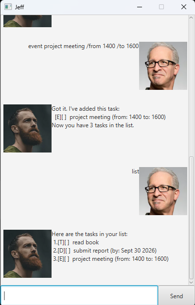

# Jeff User Guide

Jeff is a desktop task-management chatbot that helps you keep track of todos,
deadlines, and events through simple text commands.

Jeff can save your tasks, mark their completion status, search through them,
and update individual task details without requiring you to recreate the task.



## Quick start

1. Ensure that Java 25 is installed.
2. Download `Jeff.jar`.
3. Place the JAR file inside an empty folder.
4. Open a terminal in that folder.
5. Run:

   ```bash
   java -jar Jeff.jar
   ```

6. Enter a command in the text field.
7. Press **Enter** or click **Send**.

Jeff automatically saves your tasks after every change. Your saved tasks are
loaded again the next time the application starts.

## Input rules

- Enter one command at a time on a single line.
- Leading and trailing spaces are ignored.
- Task descriptions and event times may contain spaces.
- Task details cannot contain the pipe character (`|`).
- Commands rejected because of invalid input leave your task list unchanged.
- If saving fails after a valid command, the change remains in memory only.

## Command summary

| Action | Command |
|---|---|
| Add a todo | `todo DESCRIPTION` |
| Add a deadline | `deadline DESCRIPTION /by YYYY-MM-DD` |
| Add an event | `event DESCRIPTION /from START_TIME /to END_TIME` |
| List all tasks | `list` |
| Mark a task as completed | `mark TASK_NUMBER` |
| Mark a task as incomplete | `unmark TASK_NUMBER` |
| Delete a task | `delete TASK_NUMBER` |
| Find tasks | `find KEYWORD` |
| Update a task | `update TASK_NUMBER FIELD NEW_VALUE` |
| Exit Jeff | `bye` |

> Task numbers are shown when you use the `list` command.

## Understanding task symbols

Jeff uses the following symbols when displaying tasks:

| Symbol | Meaning |
|---|---|
| `[T]` | Todo |
| `[D]` | Deadline |
| `[E]` | Event |
| `[ ]` | Incomplete |
| `[X]` | Completed |

For example:

```text
[T][ ] read book
[D][X] submit report (by: Sep 30 2026)
[E][ ] project meeting (from: 1400 to: 1600)
```

## Adding a todo

Adds a task that does not have a date or time.

Format:

```text
todo DESCRIPTION
```

Example:

```text
todo read book
```

Expected response:

```text
Got it. I've added this task:
  [T][ ] read book
Now you have 1 tasks in the list.
```

## Adding a deadline

Adds a task that must be completed by a particular date.

Format:

```text
deadline DESCRIPTION /by YYYY-MM-DD
```

The date must use the `YYYY-MM-DD` format.

Example:

```text
deadline submit report /by 2026-09-30
```

Expected response:

```text
Got it. I've added this task:
  [D][ ] submit report (by: Sep 30 2026)
Now you have 2 tasks in the list.
```

Invalid example:

```text
deadline submit report /by 30-09-2026
```

Jeff will respond with:

```text
Please enter the date in YYYY-MM-DD format.
```

## Adding an event

Adds a task with a starting time and an ending time.

Use `/by` exactly once, separated from the description and date by whitespace.
Spaces or tabs are accepted around the field.

For example, `deadline report /by2026-09-30` is invalid.
Use `deadline report /by 2026-09-30` instead.

Format:

```text
event DESCRIPTION /from START_TIME /to END_TIME
```

Example:

```text
event project meeting /from 1400 /to 1600
```

Expected response:

```text
Got it. I've added this task:
  [E][ ] project meeting (from: 1400 to: 1600)
Now you have 3 tasks in the list.
```

Jeff accepts non-empty text for the start and end times. For example, you can
use `1400`, `2pm`, or `Monday afternoon`.

## Listing all tasks

Displays every task currently stored in Jeff.

Format:

```text
list
```

Example output:

```text
Here are the tasks in your list:
 1.[T][ ] read book
 2.[D][ ] submit report (by: Sep 30 2026)
 3.[E][ ] project meeting (from: 1400 to: 1600)
```

The number displayed before each task is its task number. Use this number with
commands such as `mark`, `unmark`, `delete`, and `update`.

## Marking a task as completed

Marks an existing task as completed.

Format:

```text
mark TASK_NUMBER
```

Example:

```text
mark 2
```

Expected response:

```text
Nice! I've marked this task as done:
  [X] submit report
```

The task number must refer to a task in the current task list.

## Marking a task as incomplete

Marks a completed task as incomplete again.

Format:

```text
unmark TASK_NUMBER
```

Example:

```text
unmark 2
```

Expected response:

```text
I've marked this task as undone:
  [ ] submit report
```

## Deleting a task

Deletes a task from the task list.

Format:

```text
delete TASK_NUMBER
```

Example:

```text
delete 1
```

Expected response:

```text
Noted. I've removed this task:
  [T][ ] read book
Now you have 2 tasks in the list.
```

After deletion, the remaining tasks are renumbered. Use `list` again to check
their new task numbers.

## Finding tasks

Finds tasks whose descriptions contain a keyword.

Format:

```text
find KEYWORD
```

Example:

```text
find book
```

Example output:

```text
Here are the matching tasks in your list:
 1.[T][ ] read book
 2.[D][ ] return book (by: Oct 01 2026)
```

The search is case-insensitive. For example, `find BOOK` and `find book`
produce the same matches.

Search results are numbered independently from the full task list. Searching
does not delete, reorder, or modify any tasks.

## Updating tasks

Updates one detail of an existing task without deleting and recreating it.

Format:

```text
update TASK_NUMBER FIELD NEW_VALUE
```

Only one field can be updated in each command.

Updating a task preserves its:

- task type;
- position in the task list;
- completion status; and
- other unchanged details.

### Supported update fields

| Field | Applicable task types | Purpose |
|---|---|---|
| `/description` | Todo, deadline, event | Changes the task description |
| `/by` | Deadline | Changes the deadline date |
| `/from` | Event | Changes the event start time |
| `/to` | Event | Changes the event end time |

### Updating a description

Format:

```text
update TASK_NUMBER /description NEW_DESCRIPTION
```

Example:

```text
update 1 /description read Java book
```

Expected response:

```text
I've updated this task:
  [T][ ] read Java book
```

### Updating a deadline date

Format:

```text
update TASK_NUMBER /by YYYY-MM-DD
```

Example:

```text
update 2 /by 2026-10-01
```

Expected response:

```text
I've updated this task:
  [D][ ] submit report (by: Oct 01 2026)
```

The new date must use the `YYYY-MM-DD` format.

### Updating an event start time

Format:

```text
update TASK_NUMBER /from NEW_START_TIME
```

Example:

```text
update 3 /from 1500
```

Expected response:

```text
I've updated this task:
  [E][ ] project meeting (from: 1500 to: 1600)
```

### Updating an event end time

Format:

```text
update TASK_NUMBER /to NEW_END_TIME
```

Example:

```text
update 3 /to 1800
```

Expected response:

```text
I've updated this task:
  [E][ ] project meeting (from: 1500 to: 1800)
```

### Update restrictions

Each field can only be used with a compatible task type.

For example, this command is invalid because a todo does not have a deadline:

```text
update 1 /by 2026-10-01
```

Jeff will respond with:

```text
A todo can only update /description.
```

Similarly:

- a deadline can update only `/description` or `/by`;
- an event can update only `/description`, `/from`, or `/to`; and
- an update command cannot contain more than one update field.

For example:

```text
update 3 /from 1500 /to 1800
```

Jeff will respond with:

```text
Please update one field at a time.
```

Use two separate commands instead:

```text
update 3 /from 1500
update 3 /to 1800
```

## Exiting the application

Closes Jeff.

Format:

```text
bye
```

Expected response:

```text
Bye. Hope to see you again soon!
```

The application closes shortly after displaying the farewell message.

## Saving data

Jeff automatically saves the task list whenever you:

- add a task;
- mark or unmark a task;
- delete a task; or
- update a task.

The data is stored locally in:

```text
data/jeff.txt
```

Do not edit this file manually, as invalid changes may prevent Jeff from
loading the saved tasks correctly.

### If saved tasks cannot be loaded

If the data file is unreadable or contains an invalid record, Jeff reports
the problem when you enter a command. Task commands are disabled for that
session to protect the original file. You can still exit using `bye`.

For malformed records, the message identifies the affected line.
An empty file is valid, but blank lines inside a populated file are not.

Close Jeff and back up `data/jeff.txt` before attempting recovery. Restore a
known-good backup or correct the reported record if you understand the storage
format. For access errors, check the file permissions. Restart Jeff afterward.

### If saving fails

Jeff reports that the change is kept in memory only. The usual success message
is not displayed.

Keep Jeff open and check the data folder and file permissions. Use `list` to
check the current task numbers before making further changes.

After the storage problem is fixed, the next successful command that changes
a task saves the entire current task list, including earlier unsaved changes.
For example, you can repeat an update with the same value.

The `list` and `find` commands do not retry saving. Closing Jeff, including
using `bye`, loses any changes that have not been saved successfully.

## Command examples

The following sequence demonstrates the main features:

```text
todo read book
deadline submit report /by 2026-09-30
event project meeting /from 1400 /to 1600
list
mark 2
find report
update 2 /by 2026-10-01
update 3 /to 1800
unmark 2
delete 1
list
bye
```

## Common input errors

### Missing description

Invalid command:

```text
todo
```

Response:

```text
Missing description.
```

### Missing task number

Invalid command:

```text
mark
```

Response:

```text
Please enter a task number.
```

### Invalid task number

Invalid command:

```text
delete abc
```

Response:

```text
Please enter a valid task number.
```

### Task number does not exist

If the supplied number is outside the current task list, Jeff reports that the
task number does not exist.

Run `list` to check the current task numbers before trying again.

### Missing search keyword

Invalid command:

```text
find
```

Response:

```text
A find command needs a keyword.
```

### Missing update field

Invalid command:

```text
update 1
```

Response:

```text
An update command needs a field.
```

### Missing update value

Invalid command:

```text
update 1 /description
```

Response:

```text
An update command needs a new value.
```

### Unknown command

If Jeff does not recognize the command, it responds with:

```text
Invalid command.
```
## Acknowledgements

- The JavaFX GUI structure was adapted from the
  [SE-EDU JavaFX Tutorial](https://se-education.org/guides/tutorials/javaFx.html).